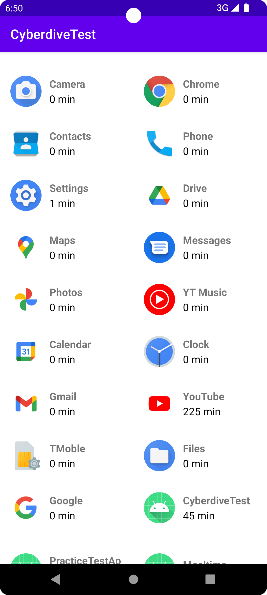
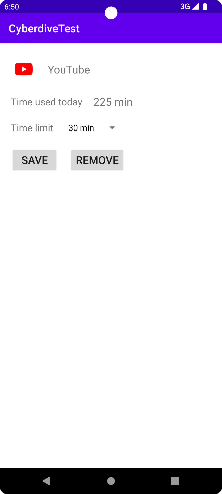
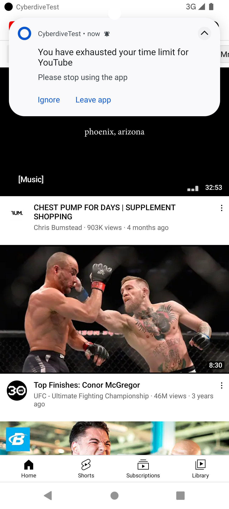

# CyberdiveTest

Stack
- The project is 100% Kotlin
- MVVM architecture have been followed.
- Hilt, Navigation compononents, Work Manager, Flows & Coroutines have been used

Build Instructions

- Clone the project and add it in Android Studio.
- Sync the project files by clicking on "Sync gradle files" button

Run Instructions

- Run the app on an emulator or a personal device by clicking on the run button in the top toolbar
- We need to provide PACKAGE_USAGE_STATS permission to use the app.
- Please refer to the screenshots in the /screenshots folder to check the UI

Assumptions or design decisions taken

- We needed to show a UI element from background. Android restricts on
showing UI element from background. We had two options - System alert
or push notifications. I decided top go ahead with the push notification 
approach because system alerts is a sensitive permission and user is more 
used to seeing push notifications for alert. 
- Currently, if time limit set, the app checks in every 15 minutes for any
app which has crossed the time limit. The 15 min time limit is an Android 
limitation if we want to cater to users on Android 12 and above. I have tried
using a hack to listen for every 1 minute in case we have an which has 
crossed the limit but the result has been flaky.

Screenshots

 1.List of apps along with their respecting time usage for the day

 2.Add/Edit time limit for an app

 3.Alert when app is used over the set limit
